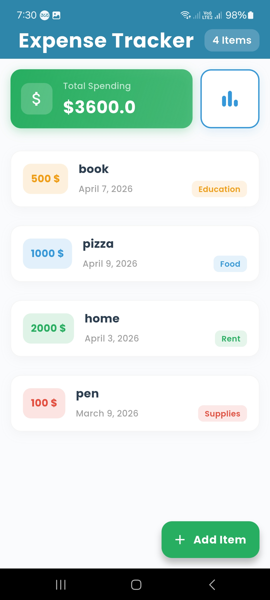
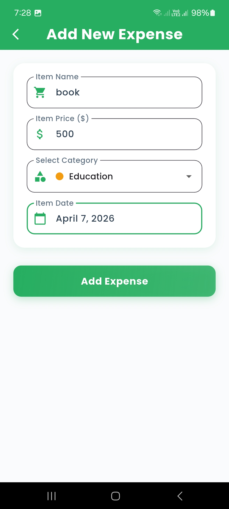
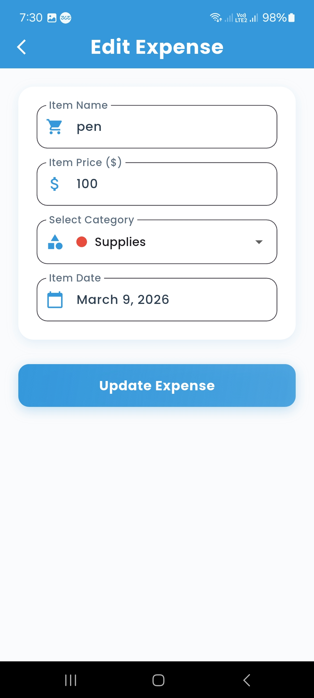
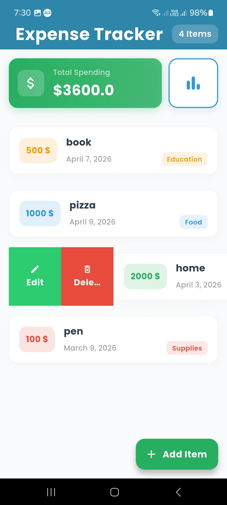
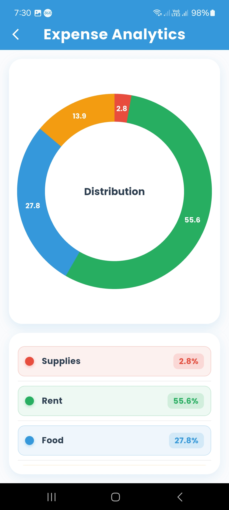
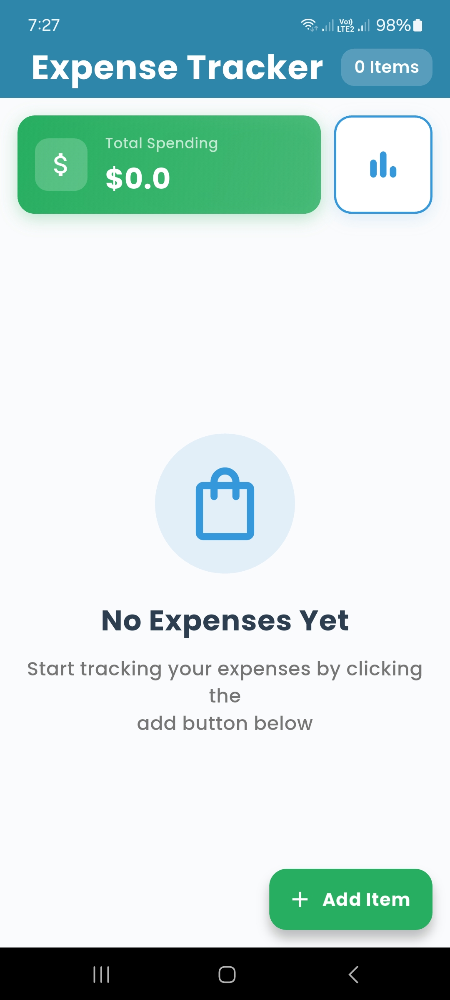
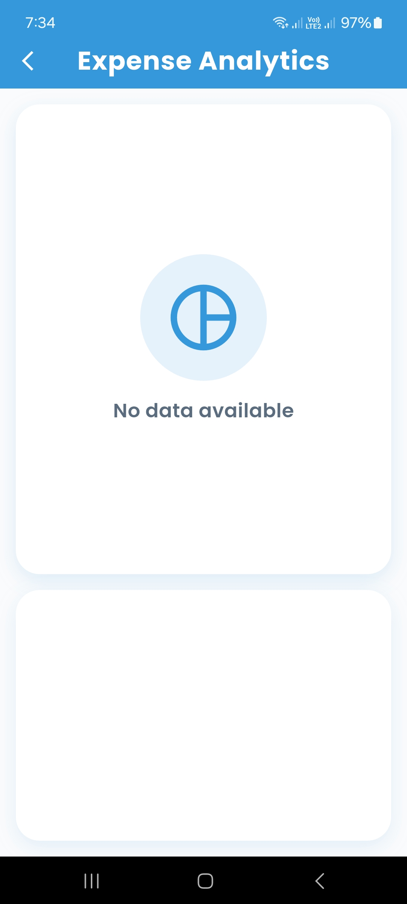

# 💰 Expense App Tracker

A professional Flutter expense tracking application with beautiful UI, smooth animations, and real-time data updates.

## ✨ Features

- ✅ **Professional UI Design** - Modern Material 3 design with Google Fonts (Poppins)
- ✅ **Smooth Animations** - Animated page transitions with elastic and slide effects
- ✅ **Add Expenses** - Easily add new expenses with category, date, and amount
- ✅ **Edit Expenses** - Update existing expenses with real-time reflection
- ✅ **Delete Expenses** - Remove expenses with undo snackbar
- ✅ **Statistics** - Interactive pie chart showing expense distribution by category
- ✅ **Real-time Updates** - Items update instantly across all screens
- ✅ **SQLite Database** - Local data persistence
- ✅ **Category Colors** - Visual category identification with color coding

## 📸 Screenshots

### Home Screen
<p align="center">
  
</p>

### Add Expense
<p align="center">
  
</p>

### Edit Expense
<p align="center">
  
  
</p>

### Statistics & Chart
<p align="center">
  
</p>

### Empty States
<p align="center">
  
  
</p>
## 📥 Download App

<p align="center">
  <a href="https://drive.google.com/uc?export=download&id=12rXrRlpXjGmnYpgx4ZiFmKT0JLheMIf9">
    
  </a>
</p>
## 🎨 Design Features

- **Color Palette**
  - Primary: Deep Blue (#2E86AB)
  - Secondary: Green (#27AE60) - For positive actions
  - Accent: Info Blue (#3498DB) - For analytics
  - Category Colors: Diverse colors for each expense category

- **Typography**
  - Font: Google Fonts (Poppins)
  - Professional text hierarchy with size variants
  - Consistent font weights (500, 600, 700)

- **Animations**
  - Page transitions: Slide (400ms)
  - FAB animation: Elastic scale
  - Chart load: Scale animation with bounce
  - Form elements: Fade + Slide animations

## 🚀 Getting Started

### Prerequisites
- Flutter SDK (3.5.4 or higher)
- Dart SDK
- Android Studio or Xcode

### Installation

1. **Clone the repository**
   ```bash
   git clone <repository-url>
   cd expense_app_tracker
   ```

2. **Install dependencies**
   ```bash
   flutter pub get
   ```

3. **Run the app**
   ```bash
   flutter run
   ```

## 📦 Dependencies

```yaml
flutter_bloc: ^9.0.0           # State management
sqflite: ^2.4.1                # SQLite database
bloc: ^9.0.0                   # BLoC pattern
intl: ^0.20.2                  # Internationalization
flutter_slidable: ^3.1.2       # Swipe actions
easy_pie_chart: ^1.0.1         # Pie chart
google_fonts: ^7.0.0           # Professional fonts
```

## 🏗️ Project Structure

```
lib/
├── main.dart                  # App entry point with theme
├── view/
│   ├── HomeScreen.dart       # Main expenses list
│   ├── Add_ItemScreen.dart   # Add expense form
│   ├── Edit_ItemScreen.dart  # Edit expense form
│   └── Pie_chart.dart        # Analytics screen
├── view_model/
│   ├── Cubit.dart            # Business logic
│   ├── States.dart           # App states
│   └── observer.dart         # BLoC observer
└── widgets/
    ├── Constants.dart        # Colors, styles, helpers
    └── Pie_chart.dart        # Chart widget
```

## 🎯 Usage

### Adding an Expense
1. Tap the "Add Item" floating action button
2. Fill in the expense name, price, category, and date
3. Tap "Add Expense"
4. The item appears instantly in the home screen

### Editing an Expense
1. Swipe left on any expense item
2. Tap the "Edit" button (green)
3. Modify the details
4. Tap "Update Expense"

### Deleting an Expense
1. Swipe left on any expense item
2. Tap the "Delete" button (red)
3. Confirm deletion

### Viewing Statistics
1. Tap the chart icon on the home screen
2. View the pie chart showing expense distribution
3. See detailed percentages in the legend

## 🔄 State Management

The app uses **BLoC (Business Logic Component)** pattern:
- `AppCubit` - Manages all app logic (add, edit, delete, calculate)
- `AppStates` - Represents different app states
- `BlocBuilder` - Rebuilds UI on state changes
- Real-time updates across all screens

## 💾 Data Persistence

- **SQLite Database** - Local storage of expenses
- **Automatic Sync** - Updates reflect instantly via BLoC
- **No Internet Required** - All data stored locally

## 📱 Categories

- 🛒 Supplies
- 🏠 Rent
- 🍔 Food
- ✨ Luxury
- 📚 Education
- 🎁 Others

## 🛠️ Development

### Building for Release

**Android:**
```bash
flutter build apk --release
flutter build appbundle --release
flutter build apk --split-per-abi
```

**iOS:**
```bash
flutter build ios --release
```

## 📝 Notes

- All UI follows Material Design 3 principles
- Smooth transitions between screens (400ms animations)
- Responsive design for different screen sizes
- Form validation with helpful error messages
- Professional shadows and elevation

## 👨‍💻 Author

**Ahmed** - Mobile Developer

## 📄 License

This project is licensed under the MIT License

## 🤝 Contributing

Feel free to fork this project and submit pull requests for any improvements.

---

**Made with ❤️ using Flutter**
